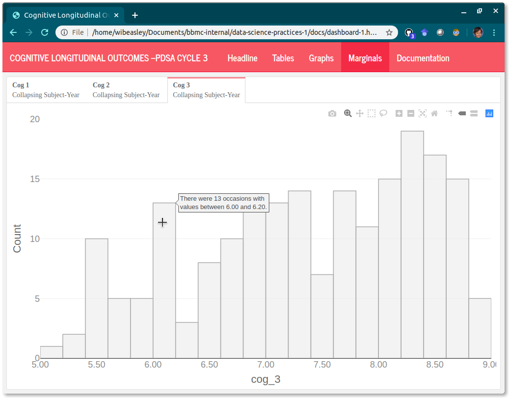
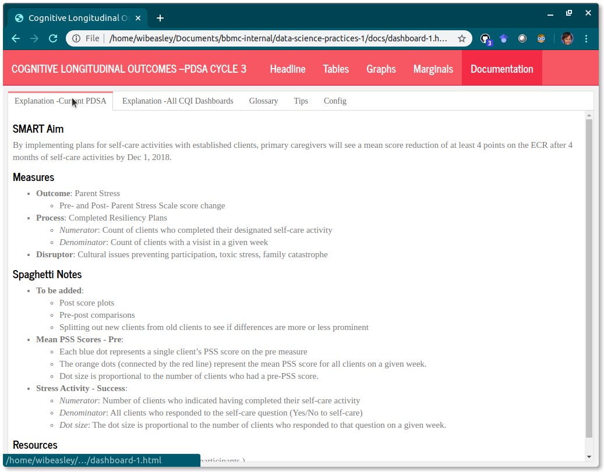

Example Dashboard {#example-dashboard}
====================================

Communicating quantitative trends to a community with a [quantitative phobia](#publication-phobic) can be difficult.  This appendix showcases a dashboard and then a style guide.  The dashboard mimics a recent CQI project where Home Visitors implemented their own intervention ideas.  Over several years, roughly twelve home visiting programs each have had four CQI cycles tailored to their interests and population.

Over 50 dashboards have been developed: a custom dashboard is developed for each program's cycle, and a three additional dashboards communicate the results of program-agnostic investigations.  A style guide is an important tool when managing this many unique investigations

For a program-specific dashboard, it's more important to meet the needs of the individual PDSA than to conform to a guide.  However, we aim to make the dashboards as consistent as possible for several reasons:

1. It's less work for the practitioners.  A familiar presentation will help the practitioners grow comfortable with their new cycle's dashboard.  Recall most will use at least five dashboards in only a few years.
1. It's less work for the analysts/developers. Within a cycle, a consistent format (with relatively interchangeable features) means that one analyst can more easily contribute and trouble shoot a colleague's dashboard.
1. The lessons we've learned (and mistakes we've made) can be applied to later dashboards.  The quality should improve and the development should quicken.

Example {#example-dashboard-example}
------------------------------------

Please view the active html at [https://ouhscbbmc.github.io/data-science-practices-1/dashboard-1.html](https://ouhscbbmc.github.io/data-science-practices-1/dashboard-1.html).  The dashboard source code is available in the [`analysis/dashboard-1`](https://github.com/wibeasley/RAnalysisSkeleton/tree/master/analysis/dashboard-1) directory of the [R Analysis Skeleton](https://github.com/wibeasley/RAnalysisSkeleton) repository'; this repo documents and contains the code for the entire pipeline leading up to this dashboard.

In this dashboard of synthetic data), a cognitive measure is tracked across 14 years in three home visiting counties.

Style Guide {#example-dashboard-guide}
------------------------------------

This section describes a set of practices that the [BBMC analysts](https://ouhsc.edu/bbmc/) have decided are best for the CQI dashboards used in our MIECHV evaluations.  In a sense, this CQI dashboard guide supplements our overall [style guide](#style).


### Development Life-cycle

Just like our CQI grant encourages an HV program to learn from its history and to learn from others, the analysts should too.  As we work with the programs to design a PDSA dashboard, each one of us will learn about the strengths and weaknesses of our current dashboard style.

### Layout

#### Summary page

<a href="https://ouhscbbmc.github.io/data-science-practices-1/dashboard-1.html#summary">
    
</a>

The [dashboard's greeting](https://ouhscbbmc.github.io/data-science-practices-1/dashboard-1.html#summary) should be a good blend of (a) orientating the user to the context and (b) being welcoming but not overwhelming.  For the second PDSA cycle, try to have only one important/impact graph on the first page; marginals have their own page later.

1. **Left column: Text** qualified with `{.tabset}`
    1. **Notes tab**: text that provides info about the dashboard's dataset, such as
        * Count of (a) models, (b) programs, (c) clients, and (d) observations
        * Date range
        * The specific `program_code`s.  Even though a PDSA is focused on a specific program, ideally other programs are included so they have a feel for what others are doing.
1. **Right column: Headline Graph(s)** optionally qualified with `{.tabset}`.
    * Ideally starts with an overall graph, with no longitudinal component.
    * Show data only from the program, not the overall model.

#### Tables page

<a href="https://ouhscbbmc.github.io/data-science-practices-1/dashboard-1.html#tables">
    
</a>

The [tables provide exactness](https://ouhscbbmc.github.io/data-science-practices-1/dashboard-1.html#tables), especially the exactness of (a) the actual *y* value and (b) the frequency of the longitudinal values.  These tables make it easier to see if you're inadvertently plotting multiple values for the same month, or if some month is missing.  In the future, we can add a 'Download as CSV' button if anyone requests it.

Another advantage of the tables is that all measures are visible in the same screen.  A typical program-month table will have at least 6 columns: `program_code`, `month`, `model`, outcome measure, process measure, and disruptor measure.  If this is difficult to do, then the upstream scribe probably isn't doing its job well.  These tables should be almost untouched from the rds files created in the 'load-data' chunk.

Each tab should represent a different unit of analysis (*e.g.*, a single row summarizing the completed visits for a program-month).  Use all the tabs below that are appropriate for the PDSA.  Go from biggest unit (*e.g.*, model) to smallest unit (*e.g.*, Provider-Week).

1. **Unnamed column** qualified with `{.tabset}`.

    1. **Model tab**
    1. **Program tab**
    1. **Program-Month tab**
    1. **Program-Week tab**
    1. **Provider-Week tab**
    1. **Spaghetti Annotation tab**  If your spaghetti plots use faint vertical lines to mark events (*e.g.*, the start of a PDSA intervention), include the events here too.

#### Spaghetti page

<a href="https://ouhscbbmc.github.io/data-science-practices-1/dashboard-1.html#spaghetti">
    
</a>

The [spaghetti plots](https://ouhscbbmc.github.io/data-science-practices-1/dashboard-1.html#spaghetti) should provide the user with a feel of the trends.  One graph focuses on one measure, so ideally a max of three spaghetti plots.  Ideally the change over time (for the PDSA's program) is compared to the other programs during the same period.  If a PSDA has multiple Process Measures, give them separate tabs labeled 'Process Measure 1' & 'Process Measure 2'.

1. **Unnamed column** qualified with `{.tabset}`.

    1. **Outcome Measure tab**
    1. **Process Measure tab**
    1. **Disruptor Measure tab**

If a spaghetti plot depicts a proportion/percentage measure, then include a visual layer the count/denominator behind each proportion (instead of a separate spaghetti plot dedicated to the denominator).  This may include one or more of the following:

1. geom_point where presence/absence denotes a nonzero/zero denominator
1. geom_point where size denotes denominator's size.
1. geom_text (in place of geom_point) that explicitly shows denominator's size
1. geom_text along the bottom axis that explicitly shows denominator's size

* use `spaghetti_2()` located in [display-1.R](https://github.com/OuhscBbmc/miechv-3/blob/master/analysis/common/display-1.R). **(not yet developed.)**  Add hover text to each spaghetti.

#### Marginal Graphs page

<a href="https://ouhscbbmc.github.io/data-science-practices-1/dashboard-1.html#marginals">
    
</a>

The [marginal histograms](https://ouhscbbmc.github.io/data-science-practices-1/dashboard-1.html#marginals) provide context.

* Single column, qualified with `{.tabset}`.
* Contains a marginal/univariate graph of all variables in the analysis.

  * **Marginal graph of outcome measure**
  * **Marginal graph of process measure**
  * **Marginal graph of disruptor measure**

* Show data only from the program, not the overall model.

* Use `histogram_2()` located in [display-1.R](https://github.com/OuhscBbmc/miechv-3/blob/master/analysis/common/display-1.R) (this link is accessible only to Oklahoma's MIECHV evaluation team).  Add hover text to each histogram.

* If all datasets are the same unit of analysis (*e.g.*, 'program-month'), then don't use an H3 tab.  Use subtabs if you have marginals more than one level (*e.g.*, visit date at program-month, visit date at program-week, visit date at provider-week).  But avoid multiple levels, if possible;  especially if program isn't fluent with a single level.

* histograms have a more specific *y*-axis. For example, "Count of Months" instead of "Frequency"

#### Documentation page

<a href="https://ouhscbbmc.github.io/data-science-practices-1/dashboard-1.html#documentation">
    
</a>

The [documentation](https://ouhscbbmc.github.io/data-science-practices-1/dashboard-1.html#documentation) should be self-contained in the same html file, so it's easier for the practitioner to quickly get the explanation and return to the trends.

Sometimes it's best to place an explanation/annotation right next to the relevant content, but other times it's distracting.  And it's always more work to maintain the explanations if they're spread-out across the interface.  So let's try keeping almost everything under one or two tabs in the Documentation page.

To help beyond that, let's try to reuse as many documentation tabs as possible.  The first tab will be specific to the methodology and displays of the PDSA.  The remaining tabs will reference common Rmd files; the content will automatically  update when the dashboard is rendered next.

1. **Unnamed column** qualified with `{.tabset}`.

    1. **Explanation --Current PDSA**
    1. **Explanation --All CQI Dashboards**
    1. **Glossary**
    1. **Tips**
    1. **Config**

#### Miscellaneous Notes

* The hierarchy level in this outline indicates the HTML-heading level.  Numbers are H1 (*i.e.*, `======`) that specify pages, roman numerals are H2 (*i.e.*, `------`) that specify columns, and letters are H3 (*i.e.*, `###`) that specify tabs.

* Cosmetics connote the type of dashboard.  Specify using the `theme` or `css` yaml keywords in the Rmd header.

  * **Common measures**: [`theme: simplex`](https://bootswatch.com/flatly/) uses a red banner.
  * **1st cycle PDSAs** (*i.e.*, initial cycle of MIECHV 3): [`theme: cosmo`](https://bootswatch.com/cosmo/) uses a blue banner.  This default is used if no theme is specified.
  * **2nd cycle PDSAs**: [`theme: flatly`](https://bootswatch.com/flatly/) uses a turquoise banner.
  * **3rd cycle PDSAs**: [`theme: journal`](https://bootswatch.com/journal/) uses a light red banner.
  * **4th cycle PDSAs** (*i.e.*, initial cycle of MIECHV 5): [custom css](https://github.com/OuhscBbmc/miechv-3/blob/master/analysis/common/style-cqi-cycle-4.css) with a purple banner .  Instead of a theme, the below line (with four leading spaces, because the yaml entry is nested under `output` and `flexdashboard::flex_dashboard`):

      ```Rmd
          css: ../../common/style-cqi-cycle-4.css
      ```

### Incoming Dataset

* Very little data manipulation should occur in the dashboard.  The upstream scribe should produce an analysis-ready rds file.  The scribe should be concerned only with presenting the graphs, tables, and summary text.

* Include a common measure if the PDSA explicitly mentions it.  Try to show measures only if they're directly related to the PDSA.  The PDSA dashboard will have less exposure to change (which makes it easier to maintain).  If programs need context for their measures, they can look at the common measure dashboard.
